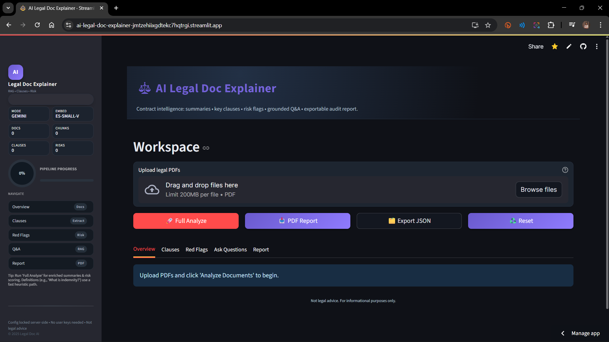

<h1 align="center">AI Legal Doc Explainer</h1>

> Not legal advice. Educational assistance for faster contract comprehension.

<p align="center">
	
	<br/>
	<em>Home screen: upload PDFs, run analysis, explore summaries, clauses, red flags, and Q&A.</em>
	<br/>
</p>

## Features
* Multi-PDF ingestion (contracts, leases, terms) with text cleanup
* Map-reduce plain-language summarization (5–10 bullets per doc)
* Key clause extraction (Termination, Payment, Liability, Indemnity, etc.)
* Red flag detection (hybrid heuristic + LLM scoring) with confidence threshold
* RAG grounded Q&A with page citations (FAISS + HF embeddings)
* Exportable PDF report (summaries, clauses, flags, Q&A log)
* Editable prompt templates under `src/prompts/`
* Gemini primary LLM with open-source fallback (transformers) automatically
* Configuration via `.env` or sidebar (confidence threshold, models)
* Privacy-focused: local parsing + indexing only

## Tech Stack
* Streamlit UI
* LangChain for chunking & retrieval
* FAISS vector store (local, persistence in `workspace_tmp/`)
* Embeddings: `intfloat/e5-small-v2` (default, switchable)
* LLM: Gemini 1.5 Flash (free tier) or local HF model fallback
* Report generation: ReportLab
* Testing: pytest; Linting: ruff

## Quick Start (Local)
```bash
pip install -r requirements.txt
streamlit run app.py
```

Set environment variables (create `.env` from `.env.example`):
```
GOOGLE_API_KEY=your_key_optional
EMBED_MODEL=intfloat/e5-small-v2
LOCAL_LLM_MODEL=Qwen/Qwen2.5-7B-Instruct
USE_GEMINI=true
CONFIDENCE_THRESHOLD=65
LOCAL_LLM_SMALL=false
```

If `GOOGLE_API_KEY` missing or `USE_GEMINI=false`, fallback model is used.
If large model load fails on Windows (DLL / pyarrow / sklearn errors), set `LOCAL_LLM_SMALL=true` to force a lightweight CPU model (distilgpt2) or provide a Gemini key for higher quality.
If embedding model import fails (transformers / sentence-transformers issues), set `DISABLE_HF_EMBED=true` to use a hashing fallback (reduced semantic quality but functional for testing).

## Streamlit Cloud Deploy
1. Push repo to GitHub (this branch).
2. Go to https://share.streamlit.io -> New App -> select repo -> `app.py`.
3. Add secrets (Settings -> Secrets) like:
```
GOOGLE_API_KEY="your_key_optional"
USE_GEMINI="true"
LOCAL_LLM_SMALL="true"
EMBED_MODEL="intfloat/e5-small-v2"
CONFIDENCE_THRESHOLD="65"
```
4. (Optional) If embedding model load causes slow cold start set `DISABLE_HF_EMBED="true"`.
5. Deploy; upload a sample PDF or include one in `samples/`.

## Hugging Face Spaces Deploy (Alternative)
See `README-deploy-hf.md` (Streamlit Space). Ensure `runtime.txt` pins Python.

## Environment Flags Summary
| Variable | Purpose | Suggested Cloud Value |
|----------|---------|-----------------------|
| USE_GEMINI | Use Gemini over local model | true |
| LOCAL_LLM_SMALL | Force lightweight local fallback | true |
| DISABLE_HF_EMBED | Skip HF embeddings -> hashing | false (true if startup fails) |
| EMBED_MODEL | Embedding model id | intfloat/e5-small-v2 |
| LOCAL_LLM_MODEL | Larger local model (if GPU) | Qwen/Qwen2.5-7B-Instruct |
| CONFIDENCE_THRESHOLD | Filter low-risk flags | 65 |


## Hugging Face Spaces Deploy
See `README-deploy-hf.md` for step-by-step. Create Streamlit Space, add secrets, push repo.

## Workflow
1. Upload PDFs (sidebar)
2. Click Analyze: pipeline runs (parse -> chunk -> embed -> index -> summarize -> clauses -> flags -> QA chain)
3. Explore tabs: Overview, Clauses, Red Flags, Ask Questions, Report
4. Download PDF report (sidebar Export)
5. Review `TECHNICAL_SUMMARY.md` (exported also as PDF for submission)

## Editable Prompts
Modify text files in `src/prompts/` and rerun the app to tweak summarization, clause extraction, red flag scoring, and QA grounding.

## Tests & Lint
```bash
make lint
make test
```

## Limitations
* Approximate page numbers (chunk-based)
* Local fallback LLM on CPU can be slow
* Risk scores heuristic + LLM (not authoritative)

## Disclaimer
This tool does not provide legal advice. Always consult a qualified attorney for legal decisions.

## License
MIT

